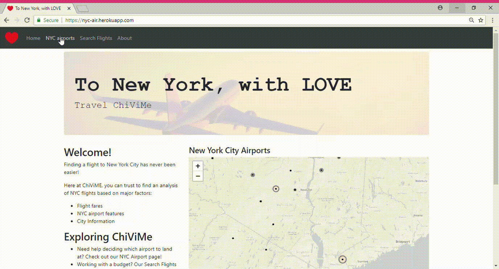

# Destination: New York City 
New York City is a popular tourist destination for travelers around the world and business hub. Most, especially those outside North America, will opt to flight into one of the major airports in the NY/NJ region.

**_Our goal_**: Give the user information about airports near the city and fare options from their departure airport.

### Data sources:
- Airport CSV files from [Airport IQ 5010](https://www.gcr1.com/5010WEB/)
- Amadeus Travel Innovation Sandbox [Low-Flight Fares Search](https://sandbox.amadeus.com/travel-innovation-sandbox/apis/get/flights/low-fare-search)
- Info on EWR, JFK, LGA, and SWF from the [Port Authority](https://www.panynj.gov/airports/general-information.html)

### Tools used:
- Javascript: Ajax/jQuery, D3.js, Leaflet, Plotly
- Python: Pandas, Flask
- HTML/CSS
- MongoDB
- Tableau
- Heroku (app deployment)

### Deployed app can be viewed on https://nyc-air.herokuapp.com/

